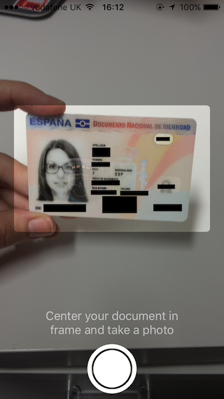
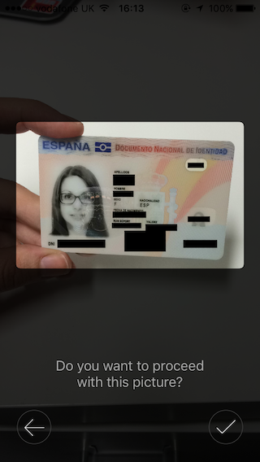
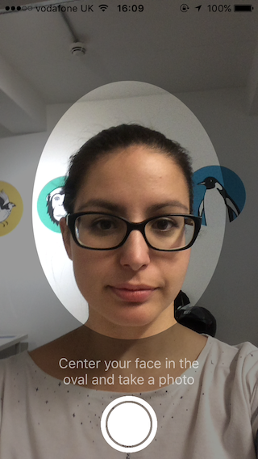
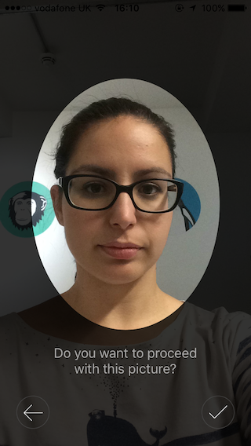

# Onfido

[](http://cocoapods.org/pods/Onfido)
[](http://cocoapods.org/pods/Onfido)
[](http://cocoapods.org/pods/Onfido)

[Onfido](https://onfido.com/) is a provider of identity verification and background checks. This SDK provides an easy way to integrate with our 
API, capture photos of documents and faces and create applicants, documents or run checks through the Onfido API.

## Table of contents

* [Definitions](#definitions)
* [Overview](#overview)
* [Prerequisites](#prerequisites)
    - [Camera permissions](#camera-permissions)
* [Setup](#setup)
* [Usage](#usage)
    - [Capture Options](#capture-options)
    - [Create Options](#create-options)
    - [Response](#response)
    - [API Token](#api-token)
    - [Error handling](#error-handling)
        + [run() method errors](#run-method-errors)
        + [Response handler](#response-handler)
* [Deployemnt](#deployemnt)
* [Sample App](#sample-app)
* [Support](#support)

## Definitions

Throughout this guide, these terms will be used:
"applicant" - the data structure that holds the information about the user you're trying to run the checks on;
"check" - the set of reports you're running on an applicant;
"report" - each of the different parts of a check (e.g. identity, document, facial_similarity);
"document" – a photo of an applicant's document (e.g. Passport, Driver Licence, National ID card);
"live photo" – a photo of the applicant's face.

## Overview

The SDK provides a drop-in integration for iOS apps and include the following features:

1. Take photos and validate the quality of documents and live photos
2. Create applicants with the Onfido API
3. Associate documents and live photos with the applicant
3. Run checks on the applicant

By using the SDK you don't need to implement the photo capture screens, saving on development time and you can leverage our input validation to ensure good quality captures before you run the checks.

## Setup

The SDK is availble on Cocoapods and you can include it in your projects by adding it to your Podfile:

```ruby
pod 'Onfido'
```

## Prerequisites

### Camera permissions

The Onfido Flow makes use of the Camera of the user device. Your will be required to have the `NSCameraUsageDescription` key in your application's `Info.plist` file in order to access the camera, otherwise your app will crash.

The Onfido SDK will prompt the user to allow access to your application to the camera of the device. If the user rejects the SDK will throw an error in the form of `OnfidoResponse.error(Error)` with the inner `Error` object being an `OnfidoFlowError.cameraPermission`.

Otherwise if the user has previously denied access to the camera the `OnfidoFlow` instance method `run()` will throw an `OnfidoFlowError.cameraPermission`.

Example:

```
<key>NSCameraUsageDescription</key>
<string>Required for document and facial capture</string>
```

## Usage

After adding the SDK as a dependency of your project and running `pod install`, you can launch the Onfido SDK flow choosing what screens to show, what to capture and what data to create on our API.

You should initialise the `OnfidoFlow` class and present with the `run()` method which will contain all the relevant steps you asked for when initialising.

```
let onfidoFlow = OnfidoFlow(apiToken: "YOUR API TOKEN")
    .and(capture: captureOptions)
    .and(create: createOptions)
    .and(handleResponseWith: { onfidoResponse in
    })

let onfidoRun = try! onfidoFlow.run()

self.presentViewController(onfidoRun, animated: true, completion: nil)
```

Make sure to keep a string reference to the OnfidoFlow object until a response handler has been called, otherwise the flow won't work correctly.

### Capture Options

The `and(capture captureOptions: [CaptureOption])` method takes an Array of `CaptureOption`'s as a parameter which may include `.document` and `.livePhoto`.
The screens for each of these options look like this:







### Create Options

The `and(create createOptions: [CreateOption])` method will take an array defining what should be created using the Onfido API.

Keys define the entities and may include `.document(validate: Bool)`, `.livePhoto`, `.applicant(Applicant)` and `.check(Check)`.

For `.applicant` – which is required if you also choose to create any of the other entities – the value passed should be an `Applicant` object which mimics the definition of an Applicant based on our API documentation found [here](https://documentation.onfido.com/#applicant-object). An example follows:

```
let dobString = "1956-10-01"
let dateFormatter = DateFormatter()
dateFormatter.dateFormat = "yyyy-mm-dd"
let dobDate = dateFormatter.date(from: dobString)!

let address = Address(
    buildingNumber: "10",
    street: "Downing St",
    town: "London",
    postcode: "SW1A 2AA",
    country: "GBR"
)

let applicant = Applicant.new(
    firstName: "Theresa",
    lastName: "May",
    email: "pm@number10.gov.uk",
    dateOfBirth: dobDate,
    country: "GBR",
    idNumbers: [],
    addresses: [address]
)
```

As for the `.check` the accepted options are:

```
let checkBuilder = Check
        .builder()
        .with(type: .express)

let identityReport = Report(name: .identity)
checkBuilder.with(report: identityReport)

let documentReport = Report(name: .document)
checkBuilder.with(report: documentReport)

let facialSimilarityReport = Report(name: .facialSimilarity)
checkBuilder.with(report: facialSimilarityReport)
```

These options resemble the structure described in our API documentation [here](https://documentation.onfido.com/#create-check) and you can refer to that page for any details.

### Response

By calling `and(handleResponseWith responseHandler: (OnfidoResponse) -> Void)` you'll be able to define a closure to run after all the work on the SDK is finished.

The object passed as a parameter of the closure is an instance of `OnfidoResponse` and may include the following attributes: `.success([OnfidoResult])`, `.error(Error)` and `.cancel`.

In case you called `and(capture captureOptions: [CaptureOption])` or `and(create createOptions: [CreateOption])`, the objects captured (`.document` or `livePhotos`) or created (applicants or checks) will be available as associated values of the enum `OnfidoResult` (`.document(DocumentResult?, Data)`, `.livePhoto(LivePhotoResult?, Data)`, `.check(CheckResult)`, `.applicant(ApplicantResult)`).

Captured documents can be accessed like this:

```swift
let document = self.completionResults?.filter({ $0 == OnfidoResult.document(validationResult: DocumentResult.empty(), file: Data()) }).first

        if let document = document, case let OnfidoResult.document(validationResult: _, file: documentCapture) = document {

            if let image = UIImage(data: documentCapture) {
                self.documentCaptureImageView.image = image
                self.documentCaptureImageView.contentMode = UIViewContentMode.scaleAspectFit
            }
        }
```

Use [ResultObject].empty() for enum equality. This is a workaround when trying to locate specific enum values within an array and not its associated values.

The same applies for `.livePhoto`.

If you also requested these entities would be created using Onfido API, those objects will also include all the details conforming to the API structure which you can check [here](https://documentation.onfido.com/#live-photo-object) and [here](https://documentation.onfido.com/#document-object).

A similar approach can be used if an applicant has been created or a set of checks has been requested. The object definitions are also available as part of our API documentation [here](https://documentation.onfido.com/#applicant-object) and [here](https://documentation.onfido.com/#check-object).

### API Token

You can ask for you API Token by contacting our support team or through your account manager and you can signup [here](https://onfido.com/signup) if you're not a client yet.

### Error handling

#### run() method errors

The OnfidoFlow.run() instance method will throw an `OnfidoFlowError.cameraPermission` if the user has previously denied camera access to the application in the past.

#### Response handler

Subscribe to the response handler when creating the flow to handle errors. i.e.

```
let onfidoFlow = OnfidoFlow(apiToken: "YOUR API TOKEN")
    ....
    .and(handleResponseWith: { response in

        switch response {

            case .error(let error):
                // handle error here
            defaulf:
                // other cases
        }
    })

self.presentViewController(onfidoFlow.run(), animated: true, completion: nil)
```

The errors will be wrapped in `OnfidoFlowError` enums with each case specifying the domain from which the error it occurs, i.e. `.applicant(ApplicantError)` or `document(DocumentError)`.

Example to handle Applicant creation error:

```
let responseHandler: (OnfidoResponse) -> Void = { [unowned self] response in
            
    switch response {
        
        case .error(let error):
        
            self.dismiss(animated: true) {

                if case let OnfidoFlowError.applicant(applicantError) = error, case let ApplicantError.upload(apiError) = applicantError {
                    print(apiError.fields) // prints fields that were incorrectly filled or lacking to console
                } else {
                    print("Unhandled error")
                }

            }
        default:
            // ...
    }
```

# Deployemnt

Due to the fact that the Onfido SDK is a precompiled framework, we have precompiled the SDK in Debug and Release. Import different pods for the different distributions:

* Debug - Include `pod 'Onfido'` to your project.
* Release - Include `pod 'Onfido-Release'` to your project.

# Sample App

We have included a Sample App to show how to integrate with the Onfido SDK. Check out the SampleApp directory.

# Support

Please open an issue through GitHub. Please be as detailed as you can. Remember not to submit your token in the issue. Also check the closed issues to check whether it has been previously raised and answered.

If you have any issues that contain sensitive information please send us an email with the `ISSUE:` at the start of the subject to [ios-sdk@onfido.com](mailto:ios-sdk@onfido.com?Subject=ISSUE%3A)

Copyright 2016 Onfido, Ltd. All rights reserved.