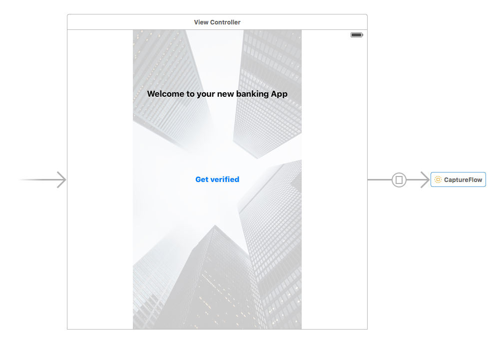

# Onfido iOS SDK

> Note: The SDK is currently under development and being privately tested.  It will soon be publicly available.

This SDK provides Onfido customers with an easy way to integrate with our product and offered services.

## Overview

The SDK provides a drop-in integration for iOS apps and include the following features:

1. Take and evaluate the quality of document and face photos
2. Start checks with our API

By using the SDK you won't need to implement the photo capture screens yourself and we'll even check an actual document is in frame as well as general quality of the photos like brightness, contrast and sharpness.

## Setup

The SDK will be availble on Cocoapods and the standard way to include it in your projects is adding this line to your Podfile:

```ruby
pod 'OnfidoCaptureSDK'
```

## Usage

After adding the SDK as a dependency of your project, you can launch the full flow by creating a [Storyboard Reference](https://developer.apple.com/library/ios/recipes/xcode_help-IB_storyboard/Chapters/AddSBReference.html) to the SDK Storyboard like below.



Set the name of the Storyboard to `CaptureFlow` and `org.cocoapods.OnfidoCaptureSDK` as the Bundle name. Check the following image for reference.


The SDK flow will guide the end user and capture the applicant's personal details (name, date of birth and address are needed to run an identity check) and will capture a photo of a document and a facial capture, to be used in a document and facial similarity check.

### Initialisation

`Onfido` is a singleton and can be configured at anypoint, for example in your App Delegate upon application loading like: 

```swift
Onfido.config("test_VBT_HMGBSAdf4fFDf4wdsjRr8iDi1mT", sandbox: false)
```

### Onfido API

The SDK also includes Swift bindings for all the endpoints currently supported by our API: creating applicants, running checks, retrieving reports. More details about these endpoints in our [documentation](https://onfido.com/documentation).

The API wrapper can then be used like below, e.g. to retrieve all Applicants:

```swift
OnfidoAPI.listApplicants(
  { applicants in
      // applicants is a [Applicant]
  },
  failure: { error in
      // error is a NSError
  }
)
```

### Callbacks

When done, the SDK will return to the host app with the results of the check.
This is still in the works and more details about this will be added here once the SDK is publicly available. Essentially the results will include the identity, document and facial reports.

## Plans

The first version will be launched with a complete flow to capture applicant details and take photos of the document and applicant.
The next version will allow for customised flow like which and how many documents asked as well as specifically calling a single screen (like facial capture).