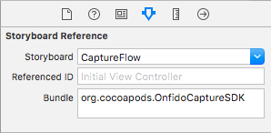

# Onfido iOS SDK

> Note: The SDK is currently under development, being privately tested and quickly reaching the first public version (expectable within no more than a couple of weeks). This documentation reflects how the SDK behaves and will be valid upon public release.

This SDK provides Onfido customers with an easy way to integrate with our product and offered services.

## Overview

The SDK provides a drop-in integration for iOS apps and include the following features:

1. Take and evaluate the quality of document and face photos
2. Start checks with our API

By using the SDK you won't need to implement the photo capture screens yourself and we'll even check an actual document is in frame as well as general quality of the photos like brightness, contrast and sharpness.

TODO TODO TODO
IMAGE HERE
TODO TODO TODO

## Setup

The SDK will be availble on Cocoapods and the standard way to include it in your projects is adding this line to your Podfile:

```ruby
pod 'OnfidoCaptureSDK'
```

## Usage

After adding the SDK as a dependency of your project, you can launch the full flow by creating a [Storyboard Reference](https://developer.apple.com/library/ios/recipes/xcode_help-IB_storyboard/Chapters/AddSBReference.html) to a Storyboard called `CaptureFlow` and set `org.cocoapods.OnfidoCaptureSDK` as the Bundle name. Check the following image for reference.



## Plans