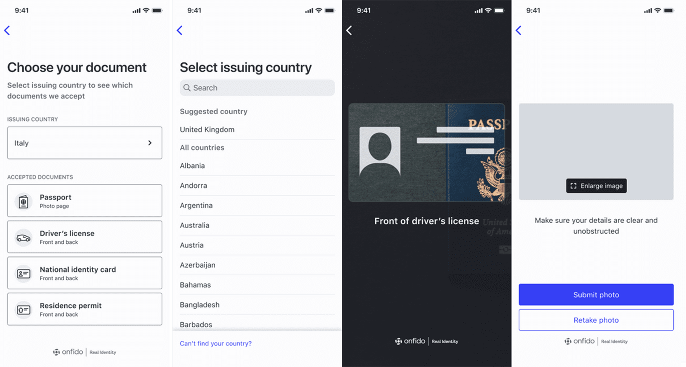
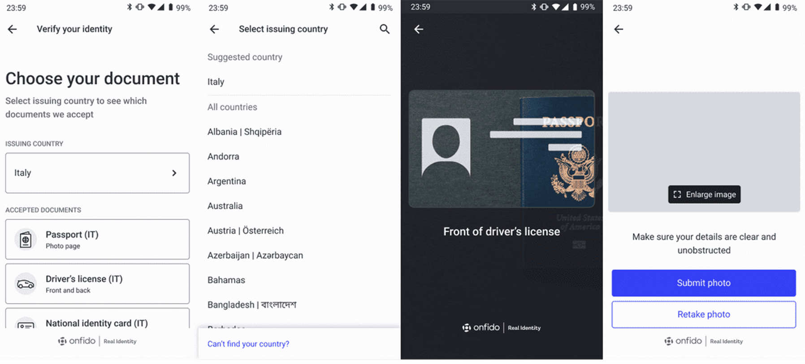
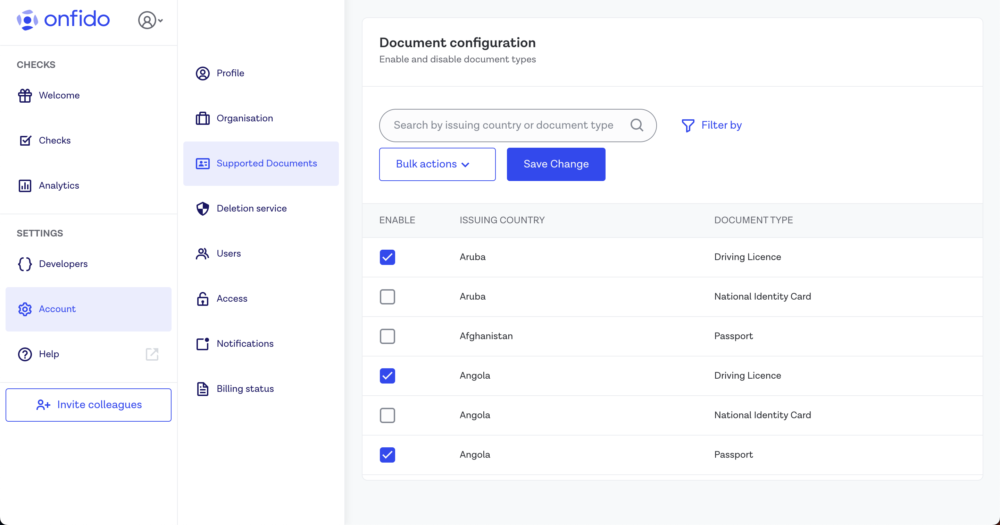

# Onfido Smart Capture iOS SDK

[](http://cocoapods.org/pods/Onfido)
[](https://swift.org/package-manager/)
[](https://github.com/Carthage/Carthage)
[](https://www.bitrise.io/app/d04e3a422799521b)
[](http://cocoapods.org/pods/Onfido)
[](http://cocoapods.org/pods/Onfido)

## Table of contents

* [1. Overview](#overview)
* [2. Adding the SDK dependency](#adding-the-sdk-dependency)
* [3. Initializing the SDK](#initializing-the-sdk)
* [4. Completing a session](#completing-a-session)
* [Advanced flow customization](#advanced-flow-customization)
* [Advanced callbacks](#advanced-callbacks)
* [User Analytics](#user-analytics)
* [Migrating](#migrating)
* [Security](#security)
* [Accessibility](#accessibility)
* [Licensing](#licensing)
* [More information](#more-information)
* [Raising support issue](#support)

## Overview

The Onfido Smart Capture SDKs provide a set of screens and functionalities that enable applications to implement user identity verification flows. Each SDK contains:

- Carefully designed UX to guide your customers through the different photo or video capture processes
- Modular design to help you seamlessly integrate the different photo or video capture processes into your application's flow
- Advanced image quality detection technology to ensure the quality of the captured images meets the requirement of the
  Onfido identity verification process, guaranteeing the best success rate
- Direct image upload to the Onfido service, to simplify integration
- A suite of advanced fraud detection signals to protect against malicious users

All Onfido Smart Capture SDKs are orchestrated using [Onfido Studio](https://developers.onfido.com/guide/onfido-studio-product) workflows, with only minor customization differences between the available platforms.


### Environments and testing with the SDK

Two environments exist to support the Onfido SDK integrations:

- 'sandbox' - to be used for testing with sample documents
- 'live' - to be used only with real documents and in production apps

The environment being used is determined by the API token that is used to generate the necessary [SDK token](#sdk-authentication).

### Going Live

Once you are satisfied with your integration and are ready to go live, please contact [client-support@onfido.com](mailto:client-support@onfido.com) to obtain a live API token. You will have to replace the sandbox token in your code with the live token.

Check that you have entered correct billing details inside your [Onfido Dashboard](https://onfido.com/dashboard/), before going live.

## Adding the SDK dependency

The iOS SDK supports:

* iOS 12+
* Xcode 15+\*
* Full bitcode support
* The SDK supports the following presentation styles:
    - Only full screen style for iPhones
    - Full screen and form sheet styles for iPads

**Note**: The latest SDK version to support Xcode 11.5-12 is iOS SDK version 22, Xcode 14+ is iOS SDK version 29. There is a workaround for older versions of Xcode if required. Please contact [support](mailto:client-support@onfido.com) for more information.

**Note**: The iOS SDK requires CoreNFC to run (regardless of whether you use NFC or not). Since Xcode 12, there is a bug where `libnfshared.dylib` is missing from simulators. Refer to [Stack Overflow](https://stackoverflow.com/questions/63915728/xcode12-corenfc-simulator-library-not-loaded) for a solution to this problem.

**Note**: In the event that you disable the NFC feature, Apple might ask you to provide a video to demonstrate NFC usage because NFC-related code is part of the SDK binary, regardless of runtime configuration. While we're working on a permanent solution for this problem, you can contact Onfido's [Customer Support team](mailto:support@onfido.com) in the meantime to obtain a video.

### App permissions

The SDK makes use of a user's device camera (for document and face capture) and microphone (for video and motion capture). You're required to have the following keys in your application's `Info.plist` file:

* `NSCameraUsageDescription`
* `NSMicrophoneUsageDescription`

```xml
<key>NSCameraUsageDescription</key>
<string>Required for document and face capture</string>
<key>NSMicrophoneUsageDescription</key>
<string>Required for video capture</string>
```

**Note**: All keys will be required for app submission.

### Adding the dependency

#### Using Swift Package Manager

The SDK is available with Swift Package Manager, and you can include it in your project by adding the following package
repository URL:

##### Swift

```swift
dependencies: [
    .package(url: "https://github.com/onfido/onfido-ios-sdk.git", .branch("master"))
]
```

#### Using CocoaPods

The SDK is also available on CocoaPods, and you can include it in your project by adding the following to your Podfile:

```ruby
pod 'Onfido'
```

Run `pod install` to get the SDK.

#### Manual installation

The SDK is available in the [GitHub Releases tab](https://github.com/onfido/onfido-ios-sdk/releases), where you can
download the compressed framework. You can find the latest
release [here](https://github.com/onfido/onfido-ios-sdk/releases/latest).

1. [Download](https://github.com/onfido/onfido-ios-sdk/releases/latest) the compressed debug zip file containing
   the `Onfido.framework`
2. Uncompress the zip file and then move the `Onfido.framework` artefact into your project
3. Add `Onfido.framework` located within your project to the `Embedded binaries` section in the `General` tab of your
   iOS app target
4. Open your app's project file in Xcode. Then select your app's target under target list
5. Next select the `Build Phases` tab and under the `Embed Frameworks` step add a new `Run Script Phase`. Name
   it `Onfido Framework Archive`
6. In the text area, add the following code:

```bash
if [[ "$ACTION" != "install" ]]; then
    exit 0;
fi

FRAMEWORK_DIR="${CONFIGURATION_BUILD_DIR}/${FRAMEWORKS_FOLDER_PATH}"
ONFIDO_FRAMEWORK="${FRAMEWORK_DIR}/Onfido.framework"

cd "${ONFIDO_FRAMEWORK}"

lipo -remove i386 Onfido -o Onfido
lipo -remove x86_64 Onfido -o Onfido
```

#### Non-Swift apps

If your app is not Swift based, then you must create a new Swift file inside of your project. This file is required to
force Xcode to package Swift runtime libraries required for the Onfido iOS SDK to run.

1. Create a Swift file with the following contents:
    ```swift
    import Foundation
    import AVFoundation
    import CoreImage
    import UIKit
    import Vision
    
    func fixLibSwiftOnoneSupport() {
        // from https://stackoverflow.com/a/54511127/2982993
        print("Fixes dyld: Library not loaded: @rpath/libswiftSwiftOnoneSupport.dylib")
    }
    ```
2. Set `Always Embed Swift Standard Libraries` to `Yes` in your project configuration.


## Initializing the SDK

The iOS SDK has multiple initialization and customization options that provide flexibility to your integration, while remaining easy to integrate.

### Defining a workflow

Onfido Studio is the platform used to create highly reusable identity verification workflows for use with the Onfido SDKs. For an introduction to working with workflows, please refer to our [Getting Started guide](https://developers.onfido.com/guide/general-introduction), or the Onfido Studio [product guide](https://developers.onfido.com/guide/onfido-studio-product).

SDK sessions are orchestrated by a session-specific `workflow_run_id`, itself derived from a `workflow_id`, the unique identifier of a given workflow.

For details on how to generate a `workflow_run_id`, please refer to the `POST /workflow_runs/` endpoint definition in the Onfido [API reference](https://documentation.onfido.com/#workflow-runs).

<Callout type="warning">

> **Note** that in the context of the SDK, the `workflow_run_id` property is referred to as `workflowRunId`.

</Callout>

#### Applicant ID reuse

When defining workflows and creating identity verifications, we highly recommend saving the `applicant_id` against a specific user for potential reuse. This helps to keep track of users should you wish to run multiple identity verifications on the same individual, or in scenarios where a user returns to and resumes a verification flow.

### SDK authentication

The SDK is authenticated using SDK tokens. As each SDK token must be specific to a given applicant and session, a new token must be generated each time you initialize the Onfido iOS SDK.

| Parameter        | Notes                                                                                                                                                                                                                                                   |
|------------------|---------------------------------------------------------------------------------------------------------------------------------------------------------------------------------------------------------------------------------------------------------|
| `applicant_id`   | **required** <br /> Specifies the applicant for the SDK instance.                                                                                                                                                                                       |
| `application_id` | **required** <br /> The application ID (for iOS "application bundle ID") that was set up during development. For iOS, this is usually in the form `com.your-company.app-name`. Make sure to use a valid `application_id` or you'll receive a 401 error. |

For details on how to generate SDK tokens, please refer to `POST /sdk_token/` definition in the Onfido [API reference](https://documentation.onfido.com/#generate-sdk-token).

**Note**: You must never use API tokens in the frontend of your application as malicious users could discover them in your source code. You should only use them on your server.

#### `withTokenExpirationHandler`

It's important to note that SDK tokens expire after **90 minutes**.

With this in mind, we recommend you use the optional `withTokenExpirationHandler` parameter in the SDK token configuration function to generate and pass a new SDK token when it expires. This ensures the SDK continues its flow even after an SDK token has expired.

##### Swift

```swift
func getSDKToken(_ completion: @escaping (String) -> Void) {
    // Your network request logic to retrieve SDK token goes here
    completion(myNewSDKtoken)
}

let workflowConfiguration = WorkflowConfiguration(workflowRunId: "<WORKFLOW_RUN_ID>", sdkToken: "<YOUR_SDK_TOKEN>")
workflowConfiguration.withTokenExpirationHandler(handler: getSDKToken)
```

##### Objective-C

```objc
-(void) getSDKTokenWithCompletion: (void(^)(NSString *))handler {
   // <Your network request logic to retrieve SDK token goes here>
   handler(sdkToken);
}

ONWorkflowConfiguration *workflowConfiguration = [[ONWorkflowConfiguration  alloc] initWithWorkflowRunId: @"<WORKFLOW_RUN_ID>"  sdkToken: @"<YOUR_SDK_TOKEN>"];
[workflowConfiguration withTokenExpirationHandler: ^(void (^handler)(NSString *)) { 
    [self getSDKTokenWithCompletion:handler]; 
}];
```

### Build a configuration object

To use the SDK, you need to obtain an instance of the client object, using your generated SDK token and workflow run ID.

##### Swift

```swift
let workflowConfiguration = WorkflowConfiguration(workflowRunId: "<WORKFLOW_RUN_ID>", sdkToken: "<YOUR_SDK_TOKEN>")
```

### Start the flow

##### Swift

```swift
let onfidoRun = OnfidoFlow(workflowConfiguration: orchestrationConfig)
customerViewController.present(try onfidoRun.run(), animated: true, completion: nil)
// listen for the result
```

### NFC capture using Onfido Studio

Recent passports, national identity cards and residence permits contain a chip that can be accessed using Near Field Communication (NFC). The Onfido SDKs provide a set of screens and functionalities to extract this information, verify its authenticity and provide the resulting verification as part of a Document report.

From version [29.1.0](https://github.com/onfido/onfido-ios-sdk/blob/master/MIGRATION.md#onfido-ios-sdk-2910-migration-guide) onwards of the Onfido iOS SDK, NFC is enabled by default and offered to end users when both the document and the device support NFC.

For more information on how to configure NFC and the list of supported documents, please refer to the [NFC for Document Report](https://developers.onfido.com/guide/document-report-nfc) guide.


#### Pre-requisites

- This feature requires `Near Field Communication Tag Reading` capability in your app target. If you haven't added it
  before, please follow the steps in [Apple's documentation](https://help.apple.com/xcode/mac/current/#/dev88ff319e7).

- You're required to have the following key in your application's `Info.plist` file:

```xml
<key>NFCReaderUsageDescription</key>
<string>Required to read ePassports</string>
```

- You have to include the entries below in your app target's `Info.plist` file to be able to read NFC tags properly.

```
<key>com.apple.developer.nfc.readersession.felica.systemcodes</key>
<array>
  <string>12FC</string>
</array>
<key>com.apple.developer.nfc.readersession.iso7816.select-identifiers</key>
<array>
  <string>A0000002471001</string>
  <string>A0000002472001</string>
  <string>00000000000000</string>
  <string>D2760000850101</string>
</array>
```

#### Disabling NFC

NFC is enabled by default. To disable NFC, call the `disableNFC()` function while configuring `OnfidoConfig` (see the [Advanced flow customization](#advanced-flow-customization) section below).

### Styling customization

The iOS SDK supports the customization of colors, fonts and strings used in the SDK flow.

### UI customization

#### Appearance and Colors

To customize the look and feel of the SDK, you can pass the required CSS values to the `Appearance` object, in the root of the `WorkflowConfiguration` object.

##### Swift

```swift
let appearance = Appearance()
appearance.primaryColor = <DESIRED_UI_COLOR_HERE>
appearance.primaryTitleColor = <DESIRED_UI_COLOR_HERE>
```

##### Objective-C

```objc
ONAppearance *appearance = [[ONAppearance alloc] init];
appearance.primaryColor = <DESIRED_UI_COLOR_HERE>;
appearance.primaryTitleColor = <DESIRED_UI_COLOR_HERE>;
```

To apply the appearance, you can use the method below:

##### Objective-C

```Objective-C
@objc
@discardableResult
public func withAppearance(_ appearance: Appearance) -> WorkflowConfiguration {
    self.appearance = appearance
    return self
}
```

Please refer to the [SDK customization documentation](https://developers.onfido.com/guide/sdk-customization#ui-customization) for details of the supported UI options that can be set in this property.

#### Dark theme

The iOS SDK supports dark theme customization. By default, the user's active device theme will be automatically applied to the Onfido SDK. However, you can opt out from dynamic theme switching at run time and instead set a theme statically at the build time as shown below. In this case, the flow will always be displayed in the selected theme regardless of the user's device theme.

`interfaceStyle` allows you to force light or dark mode via `.dark` and `.light` respectively.
By default, it is set to `.unspecified`, which will follow the system's interface style.

**Note:** The previous attribute `supportDarkMode` is now deprecated. Please use `interfaceStyle` instead.

For example, to set the interface style to `.dark`, you can use the code below:

##### Swift

```swift
let appearance = Appearance()
appearance.setUserInterfaceStyle(.dark)
```

##### Objective-C

```Objective-C
ONAppearance *appearance = [ONAppearance new];
[appearance setUserInterfaceStyle:UIUserInterfaceStyleDark];
```

#### Applying the Appearance object

To apply the appearance you can use the methods below:

##### Swift

```swift
let configBuilder = OnfidoConfig.builder()
configBuilder.withAppearance(appearance)
```

##### Objective-C

```Objective-C
ONFlowConfigBuilder *configBuilder = [ONFlowConfig builder];
[configBuilder withAppearance:appearance];
```

### Language localization

The Onfido SDK supports and maintains translations for over 40 languages.

The strings used within the SDK can be customized by having a `Localizable.strings` in your app for the desired language
and by configuring the flow using the `withCustomLocalization()` method on the configuration builder.

##### Objective-C

```Objective-C
@objc
public func withCustomLocalization() {
    configBuilder.withCustomLocalization() // will look for localizable strings in your Localizable.strings file
}
```

For the list of languages supported by Onfido, please refer to our [SDK customization documentation](https://developers.onfido.com/guide/sdk-customization#language-customization).

**Note**: If no language is selected, the SDK will detect and use the end user's device language setting. If the device's language is not supported, the SDK will default to English (`en_US`).

#### Custom languages

The SDK can also be displayed in a custom language for locales that Onfido does not currently support. You can supply
full or partial translations. For any key without a translation, the supported language default will be used.

When adding custom translations, you must add the whole set of keys included in the `Localizable.strings` file.

You can name the strings file with the translated keys as you desire but the name of the file will have to be provided
to the SDK as a parameter to the `withCustomLocalization()` method:

* `withCustomLocalization(andTableName: "MY_CUSTOM_STRINGS_FILE")` (Swift)
* `[configBuilder withCustomLocalizationWithTableName:@"MY_CUSTOM_STRINGS_FILE"];` (Objective-C)

Additionally you can specify the bundle from which to read the strings file:

* `withCustomLocalization(andTableName: "MY_CUSTOM_STRINGS_FILE", in: myBundle)` (Swift)
* `[configBuilder withCustomLocalizationWithTableName:@"MY_CUSTOM_STRINGS_FILE" in: myBundle];` (Objective-C)

**Note**:

* Any string translation change will result in a MINOR version release. Any custom translations you have should not be impacted by this if they have been implemented according to the guidance above
* You are responsible for ensuring the correct layout of any custom translations

To request a new language translation, or offer feedback or suggestions on the translations provided, you can get in touch with us at [ios-sdk@onfido.com](mailto:ios-sdk@onfido.com)

## Completing a session

### Handling callbacks

When the Onfido SDK session concludes, a range of callback functions may be triggered.

For advanced callbacks used for user analytics and returning submitted media, please refer to the [Advanced Callbacks](#advanced-callbacks) section of this document.

To receive the result from a completed workflow, you should pass a callback to the instance of `OnfidoFlow`. The following code is provided as an example:

##### Swift

```swift
onfidoRun.with(responseHandler: { (response: OnfidoResponse) in
    switch response {
        case .success:
        // User completed the flow

        case .cancel(let cancellationReason):
        // Flow cancelled by user
        print(cancellationReason)

        case .error(let error):
        // Error occurred
        print(error)

    }
},
    dismissFlowOnCompletion: true)
    // Dismiss the whole flow when the user completes it, and return back to the integrator view
```

<br>

| ATTRIBUTE        | NOTES           |
| ------------- |-------------|
| .success | Callback that fires when all interactive tasks in the workflow have been completed. On success, if you have configured [webhooks](https://documentation.onfido.com/#webhooks), a notification will be sent to your backend confirming the workflow run has finished. You do not need to create a check using your backend as this is handled directly by the workflow      |
| .error(Error)    | Callback that fires when an error occurs      |
| .cancel     | Callback that fires when the workflow was exited prematurely by the user. The reason can be  `.userExit` or `.consentDenied`      | <br>

### Error handling

The `Error` object returned as part of `OnfidoResponse.error(Error)` is of type `OnfidoFlowError`. It's an enum with multiple cases depending on the error type.

```swift
switch response {
  case let OnfidoResponse.error(error):
    switch error {
      case OnfidoFlowError.cameraPermission:
        // This happens if the user denies permission to the SDK during the flow
      case OnfidoFlowError.failedToWriteToDisk:
        // This happens when the SDK tries to save capture to disk, maybe due to a lack of space
      case OnfidoFlowError.microphonePermission:
        // This happens when the user denies permission for microphone usage by the app during the flow
      case OnfidoFlowError.upload(let OnfidoApiError):
        // This happens when the SDK receives an error from an API call.
        // See https://documentation.onfido.com/#errors for more information
      case OnfidoFlowError.exception(withError: let error, withMessage: let message):
        // This happens when an unexpected error occurs.
        // Please email ios-sdk@onfido.com when this happens
      case OnfidoFlowError.versionInsufficient:
        // This happens when you are using an older version of the iOS SDK and trying
        // to access a new functionality from workflow. You can fix this by updating the SDK
      
      default: // necessary because of Swift
    }
}
```

### Generating verification reports

While the SDK is responsible for capturing and uploading the user's media and data, identity verification reports themselves are generated based on workflows created using [Onfido Studio](https://developers.onfido.com/guide/onfido-studio-product).

For a step-by-step walkthrough of creating an identity verification using Onfido Studio and our SDKs, please refer to our [Quick Start Guide](https://developers.onfido.com/guide/quick-start-guide).

If your application initializes the Onfido iOS SDK using the options defined in the [Advanced customization](#advanced-flow-customization) section of this document, you may [create checks](https://documentation.onfido.com/#create-check) and [retrieve report results](https://documentation.onfido.com/#retrieve-report) manually using the Onfido API.
You may also configure [webhooks](https://documentation.onfido.com/#webhooks) to be notified asynchronously when the report results have been generated.

## Advanced flow customization

This section on 'Advanced customization' refers to the process of initializing the Onfido iOS SDK without the use of Onfido Studio. This process requires a manual definition of the verification steps and their configuration.

These flow step parameters are mutually exclusive with `workflowRunId`, requiring an alternative method of instantiating the client and starting the flow.

**Note** that this initialization process is **not recommended** as the majority of new features are exclusively released for Studio workflows.

### Managing SDK Token Expiry with `expireHandler`

When [generating SDK tokens](#sdk-authentication), it's important to note that they expire after 90 minutes.

With this in mind, we recommend you use the optional `expireHandler` parameter in the SDK token configuration function to generate and pass a new SDK token when it expires. This ensures the SDK continues its flow even after an SDK token has expired.

For example:

##### Swift

```swift
func getSDKToken(_ completion: @escaping (String) -> Void) {
    // Your network request logic to retrieve SDK token goes here
    completion(myNewSDKtoken)
}

let config = try OnfidoConfig.builder()
    .withSDKToken("<YOUR_SDK_TOKEN>", expireHandler: getSDKToken)
```

##### Objective-C

```Objective-C
-(void) getSDKToken: (void(^)(NSString *)) handler {
   // <Your network request logic to retrieve SDK token goes here>
   handler(sdkToken);
}

ONFlowConfigBuilder *configBuilder = [ONFlowConfig builder];
[configBuilder withSdkToken:@"YOUR_SDK_TOKEN" expireHandler:^(void (^ handler)(NSString *  expireHandler)) {
    [self getSDKToken:handler];
}];
``` 

### Create the SDK configuration

Once you have [added the SDK dependency](#add-the-sdk-dependency), and you have an applicant ID, you can manually configure the SDK flow steps:

##### Swift

```swift
let config = try OnfidoConfig.builder()
    .withSDKToken("<YOUR_SDK_TOKEN>")
    .withWelcomeStep()
    .withDocumentStep()
    .withProofOfAddressStep()
    .withFaceStep(ofVariant: .photo(withConfiguration: nil))
    .build()

let onfidoFlow = OnfidoFlow(withConfiguration: config)
    .with(responseHandler: { results in
        // Callback when flow ends
    })
```

##### Objective-C

```Objective-C
ONFlowConfigBuilder *configBuilder = [ONFlowConfig builder];

[configBuilder withSdkToken:@"YOUR_SDK_TOKEN"];
[configBuilder withWelcomeStep];
[configBuilder withDocumentStep];
[configBuilder withProofOfAddressStep];

NSError *variantConfigError = NULL;
Builder *variantBuilder = [ONFaceStepVariantConfig builder];
[variantBuilder withPhotoCaptureWithConfig: NULL];
[configBuilder withFaceStepOfVariant: [variantBuilder buildAndReturnError: &variantConfigError]];

if (variantConfigError == NULL) {
  NSError *configError = NULL;
  ONFlowConfig *config = [configBuilder buildAndReturnError:&configError];

  if (configError == NULL) {
      ONFlow *onFlow = [[ONFlow alloc] initWithFlowConfiguration:config];
      [onFlow withResponseHandler:^(ONFlowResponse *response) {
          // Callback when flow ends
      }];
  }
}
```

### Start the flow

##### Swift

```swift
try onfidoRun.run(from: yourViewController, animated: true)
```

##### Objective-C

```Objective-C
NSError *runError = NULL;
[onFlow runFrom:yourViewController animated:YES error:&runError completion:nil];

if (runError != NULL) {
    // do fallback logic
}
```

### Advanced UI customization

#### Appearance and Colors

To customize the look and feel of the SDK, you can pass the required CSS values to the `Appearance` object in the root of the `OnfidoConfig.builder()` object.

##### Swift

```swift
let appearance = Appearance()
appearance.primaryColor = <DESIRED_UI_COLOR_HERE>
appearance.primaryTitleColor = <DESIRED_UI_COLOR_HERE>
```

##### Objective-C

```objc
ONAppearance *appearance = [[ONAppearance alloc] init];
appearance.primaryColor = <DESIRED_UI_COLOR_HERE>;
appearance.primaryTitleColor = <DESIRED_UI_COLOR_HERE>;
```

To apply the appearance, you can use the methods below:

##### Swift

```swift
let configBuilder = OnfidoConfig.builder()
configBuilder.withAppearance(appearance)
```

##### Objective-C

```Objective-C
ONFlowConfigBuilder *configBuilder = [ONFlowConfig builder];
[configBuilder withAppearance:appearance];
```

Please refer to the [SDK customization documentation](https://developers.onfido.com/guide/sdk-customization#ui-customization) for details of the supported UI options that can be set in this property.

### Flow customization

You can customize the flow of the SDK by adding steps to the SDK flow.

The possible steps include:

| Step       | Description                                                                                                                                                                                                                              |
| ---------- | ---------------------------------------------------------------------------------------------------------------------------------------------------------------------------------------------------------------------------------------- |
| `withWelcomeStep`  | Welcome screen shown to the user with preliminary instructions. [Customization](#welcome-step) options include modification to the text elements and instructions shown to the user.                                                    |
| `withDocumentStep` | Set of screens that control the capture via photo or upload of the user's document. Numerous [customization](#document-step) options are available to define the document list presented to the user and the overall capture experience. |
| `withFaceStep`     | Set of screens that control the capture of a selfie, video or motion capture of the user. The [customization](#face-step) options allow the selection of the capture variant.                                        |
| `withProofOfAddressStep` | Screen where the user selects the issuing country and type of document to [verify their address](#proof-of-address-step).                                                                                   |

#### Welcome step

This step is the introduction screen of the SDK. It introduces the process and prepares the user for the steps they will need to complete. 

While this screen is **optional**, we only recommend its removal if you already have your own identity verification welcome screen in place. 

You can show the welcome screen by calling `configBuilder.withWelcomeStep()` in Swift
or `[configBuilder withWelcomeStep]` in Objective-C.

##### Swift

```swift
let config = try OnfidoConfig.builder()
    .withWelcomeStep()
    ...
    .build()
```

##### Objective-C

```Objective-C
ONFlowConfigBuilder *configBuilder = [ONFlowConfig builder];
[configBuilder withSdkToken:@"YOUR_SDK_TOKEN_HERE"];
...
[configBuilder withWelcomeStep];

NSError *configError = NULL;
ONFlowConfig *config = [configBuilder buildAndReturnError:&configError];

if (configError) {
    // Handle config build error
} else {
    // use config
}
```

#### Consent step

This step contains the consent language required when you offer your service to US users, as well as links to Onfido's policies and terms of use. For applicants created with a [`location`](https://documentation.onfido.com/#location-create-applicant) parameter value of the United States, consent collection is **mandatory**.

The user must click "Accept" to move past this step and continue with the flow. The content is available in English
only, and is not translatable.

**Note**: This step does not automatically inform Onfido that the user has given their consent:
- When creating checks using API v3.3 or lower, you need to set the value of the API parameter `privacy_notices_read_consent_given` (now deprecated) at the end of the SDK flow when [creating a check](https://documentation.onfido.com/v3.3/#create-check)
- From API v3.4 onwards, user consent is confirmed when [creating](https://documentation.onfido.com/#create-applicant) or [updating](https://documentation.onfido.com/#update-applicant) an applicant using the [consents](https://documentation.onfido.com/#consents) parameter

If you choose to disable Onfido’s SDK Consent step, you **must** still incorporate the required consent language and links to Onfido's policies and terms of use into your own application's flow before your users start interacting with the Onfido SDK.

For more information about this step, and how to collect user consent, please
visit [Onfido Privacy Notices and Consent](http://developers.onfido.com/guide/onfido-privacy-notices-and-consent).

#### Document step

In the Document Capture step, an end user can select the issuing country and document type before capture. In a very
limited number of cases, the end user may also be asked if they have a card or paper version of their document.

This information is used to optimize the capture experience, as well as inform the end user about which documents they
are allowed to use.

This selection screen is dynamic, and will be automatically hidden where the end user is not required to indicate which
document will be captured.

By default, the country selection will be pre-populated based on the end user’s primary SIM, but the end user can select
another country from the list where allowed. The selection will default to empty when no SIM is present.




You can specify allowed issuing countries and document types for the document capture step in one of three ways:

- Onfido Studio: If you are using Onfido Studio, this is configured within the Document Capture task, as documented in the [Studio Product Guide](https://developers.onfido.com/guide/onfido-studio-product#document-capture-task)
- Otherwise, the recommended approach is to apply this configuration globally in the [Dashboard](https://dashboard.onfido.com/) under Accounts \ Supported Documents. This option also ensures that the list is enforced as part of the Document Report validation. Any document that has been uploaded by an end user against your guidance will result in a Document Report sub-result of "rejected" and be flagged as `Image Integrity > Supported Document`.

##### Country and document type selection by Dashboard

Configuring the issuing country and document type selection step using your Dashboard is the recommended method of
customization (available from iOS SDK version 28.0.0 and Android SDK version 16.0.0 onwards), as this configuration is also applied to your Document Reports.

*We will be rolling out Dashboard-based configuration of allowed documents soon. In the meantime,
contact [support@onfido.com](mailto:support@onfido.com) or your Customer Support Manager to request access to this feature.*

- Open the Accounts tab on your [Dashboard](https://dashboard.onfido.com/) then click
  Supported Documents
- You will be presented with a list of all available countries and their associated supported documents. Make your
  selection, then click Save Change



**Please note the following SDK behaviour:**

- Hard coding any document type and issuing country configuration in your SDK integration will fully override the
  Dashboard-based settings
- Currently, only passport, national ID card, driving licence and residence permit are visible for document selection by
  the end user in the SDK. If you nominate other document types in your Dashboard (visa, for example), these will not be
  displayed in the user interface
- If you need to add other document types to the document selection screen, you can mitigate this limitation in the
  near-term, using the Custom Document feature
- If for any reason the configuration fails or is not enabled, the SDK will fallback to display the selection screen for
  the complete list of documents supported within the selection screens

##### Country and document type selection - SDK integration code

If you want to use your own custom document selection UI instead of displaying the Onfido document selection screen, you
will need to specify the document details during SDK initialization.

The document selection screen will be skipped automatically when the single document type is specified.

The SDK will accept the following:

- The Document Type is required. This controls fundamental SDK document capture behaviour
- The Country is optional, but recommended. This enables any optimizations the SDK may have for this specific document
  issued by this country
- The Document Format is optional, and only accepted for **French driving licence**, **Italian national identity card** and
  **South African national identity card**. This defaults to `Card`, representing modern forms of these documents. If the end
  user indicates that they have an older, paper version of one of these documents, use `Folded` to ensure an optimized
  capture experience

**Note**: You may still wish to configure the Dashboard-based approach to ensure that the Document Report also rejects any
document that has been uploaded by an end user against your guidance.

- **Document type**

The list of document types visible for the user to select can be shown or hidden using this option. Each document type
has its own configuration class. While configuring document type, you can optionally pass a configuration object along
with the document type.

The following document types are supported:

| Document Type        | Configuration Class           | Configurable Properties        |
|----------------------|-------------------------------|--------------------------------|
| passport             | PassportConfiguration         | - country                      |
| drivingLicence       | DrivingLicenceConfiguration   | - country<br> - documentFormat |
| nationalIdentityCard | NationalIdentityConfiguration | - country<br> - documentFormat |
| residencePermit      | ResidencePermitConfiguration  | - country                      |
| visa                 | VisaConfiguration             | - country                      |
| workPermit           | WorkPermitConfiguration       | - country                      |

**Note:** If only one document type is specified, users will not see the selection screen and will be taken directly to
the capture screen.

- **Document country**

Country configuration allows you to specify the country of origin of the document. This is optional, but recommended.
This enables any optimizations the SDK may have for this specific document issued by this country.

You'll need to pass the corresponding [ISO 3166-1 alpha-3](https://en.wikipedia.org/wiki/ISO_3166-1_alpha-3) country code to the SDK.

**Note**: You can specify country for all document types except `passport`. This is because passports have the same
format worldwide so the SDK does not require this additional information.

**Note:**: The SDK will throw a `OnfidoConfigError.invalidCountryCode` (`ONFlowConfigErrorInvalidCountryCode`) error
if an invalid country code is provided.

For example, to only capture UK driving licenses:

##### Swift

```swift
let config = try OnfidoConfig.builder()
    .withSDKToken("<YOUR_SDK_TOKEN_HERE>")
    .withDocumentStep(ofType: .drivingLicence(config: DrivingLicenceConfiguration(country: "GBR")))
    .build()
```

##### Objective-C

```Objective-C
ONFlowConfigBuilder *configBuilder = [ONFlowConfig builder];
[configBuilder withSdkToken:@"YOUR_SDK_TOKEN_HERE"];

NSError *documentConfigError = NULL;
DocumentConfigBuilder *documentConfigBuilder = [ONDocumentTypeConfig builder];
[documentConfigBuilder withDrivingLicenceWithConfig:[[DrivingLicenceConfiguration alloc] initWithCountry: @"GBR"]];
ONDocumentTypeConfig *documentTypeConfig = [documentConfigBuilder buildAndReturnError: documentConfigError];

if (documentConfigError) {
  // Handle variant config error
} else {
  NSError *configError = NULL;
  [configBuilder withDocumentStepOfType:documentTypeConfig];
  ONFlowConfig *config = [configBuilder buildAndReturnError:&configError];
}
```

- **Document format**

The Document Format is **optional**, and only accepted for **French driving licence**, **Italian national identity card** and **South African national identity card**. This defaults to `Card`, representing modern forms of these documents. If the end user indicates that they have an older, paper version of one of these documents, use `Folded` to ensure an optimized capture
experience.

If `Folded` is configured, the SDK will show a specific template overlay during document capture.

The following document formats are supported for each document type:

| Document Type/ Document Format | card          | folded                                                           |
|--------------------------------|---------------|------------------------------------------------------------------|
| drivingLicence                 | ALL COUNTRIES | Only France (Country code "FRA")                                 |
| nationalIdentityCard           | ALL COUNTRIES | Italy (Country code "ITA")<br> South Africa (Country code "ZAF") |

| Document Type/ Document Format |                  |
|--------------------------------|------------------|
| passport                       | NOT CONFIGURABLE |
| residencePermit                | NOT CONFIGURABLE |
| visa                           | NOT CONFIGURABLE |
| workPermit                     | NOT CONFIGURABLE |

**Note:** If you configure the SDK with an unsupported document format, the SDK will throw
an `OnfidoConfigError.invalidDocumentFormatAndCountryCombination` (`ONFlowConfigErrorInvalidDocumentFormatAndCountryCombination`
in Objective-C) error during runtime.

For example, for a folded Italian national identity card:

##### Swift

```swift
let config = try OnfidoConfig.builder()
    .withSDKToken("YOUR_SDK_TOKEN_HERE")
    .withDocumentStep(ofType: .nationalIdentityCard(config: NationalIdentityConfiguration(documentFormat: .folded, country: "ITA")))
    .build()
```

##### Objective-C

```Objective-C
ONFlowConfigBuilder *configBuilder = [ONFlowConfig builder];
[configBuilder withSdkToken:@"YOUR_SDK_TOKEN_HERE"];

NSError *documentConfigError = NULL;
DocumentConfigBuilder *documentConfigBuilder = [ONDocumentTypeConfig builder];
[documentConfigBuilder withNationalIdentityCardWithConfig:[[NationalIdentityConfiguration alloc] initWithDocumentFormat:DocumentFormatFolded country: @"ITA"]];
ONDocumentTypeConfig *documentTypeConfig = [documentConfigBuilder buildAndReturnError: documentConfigError];

if (documentConfigError) {
  // Handle variant config error
} else {
  NSError *configError = NULL;
  [configBuilder withDocumentStepOfType:documentTypeConfig];
  ONFlowConfig *config = [configBuilder buildAndReturnError:&configError];
}
```

- **Customize the issuing country and document type selection screen with pre-selected documents**

You can also customize the screen to display only a limited list of document types, using the configuration function to
specify the ones you want to show.

Currently you can only include `passport`, `identityCard`, `drivingLicence`, `residencePermit` in the list.

For example, to show only the `passport` and `drivingLicence` document types:

##### Swift

```swift
let config = try OnfidoConfig.builder()
    .withDocumentStep(ofSelectableTypes: [.passport, .drivingLicence])
```

##### Objective-C

```Objective-C
ONFlowConfigBuilder *configBuilder = [ONFlowConfig builder];
[configBuilder withDocumentStepWithSelectableDocumentTypes: @[@(SelectableDocumentTypePassport), @(SelectableDocumentTypeDrivingLicence)]];
```

#### Face step

In the Face step, a user can use the front camera of their device to capture a live photo of their face (photo), a live video (video) or a motion capture using the Motion product (Motion).

##### Objective-C

For the **Objective-C interface**, you should use `ONFaceStepVariantConfig` as shown below.

To configure for a **live photo**:

```
NSError * error;
Builder * variantBuilder = [ONFaceStepVariantConfig builder];
[variantBuilder withPhotoCaptureWithConfig: [[PhotoStepConfiguration alloc] initWithShowSelfieIntroScreen: YES]]];
[configBuilder withFaceStepOfVariant: [variantBuilder buildAndReturnError: &error]];
```

To configure for a **live video**:

```
NSError * error;
Builder * variantBuilder = [ONFaceStepVariantConfig builder];
[variantBuilder withVideoCaptureWithConfig:
   [[VideoStepConfiguration alloc] initWithShowIntroVideo: YES manualLivenessCapture: NO]];
[configBuilder withFaceStepOfVariant: [variantBuilder buildAndReturnError: &error]];
```

To configure for **Motion**:

```
NSError * error;
Builder * variantBuilder = [ONFaceStepVariantConfig builder];
[variantBuilder withMotionWithConfig: NULL];
[configBuilder withFaceStepOfVariant: [variantBuilder buildAndReturnError: &error]];
```

To configure for **Motion with audio recording**:

```
NSError * error;
Builder * variantBuilder = [ONFaceStepVariantConfig builder];
[variantBuilder withMotionWithConfig: [[MotionStepConfiguration alloc] initWithRecordAudio: YES]];
[configBuilder withFaceStepOfVariant: [variantBuilder buildAndReturnError: &error]];
```

##### Swift

The Face step has 3 variants for the **Swift interface**:

- `FaceStepVariant.photo(with: PhotoStepConfiguration?)`
- `FaceStepVariant.video(with: VideoStepConfiguration?)`
- `FaceStepVariant.motion(with: MotionStepConfiguration?)`

To configure for a **live photo**:

```swift
let config = try OnfidoConfig.builder()
    .withSDKToken("<YOUR_SDK_TOKEN_HERE>")
    .withWelcomeStep()
    .withDocumentStep()
    .withFaceStep(ofVariant: .photo(withConfiguration: PhotoStepConfiguration(showSelfieIntroScreen: true)))
    .build()
```

To configure for a **live video**:

```swift
let config = try OnfidoConfig.builder()
    .withSDKToken("<YOUR_SDK_TOKEN_HERE>")
    .withWelcomeStep()
    .withDocumentStep()
    .withFaceStep(ofVariant: .video(withConfiguration: VideoStepConfiguration(showIntroVideo: true, manualLivenessCapture: false)))
    .build()
```

To configure for **Motion**:

```swift
let config = try OnfidoConfig.builder()
    .withSDKToken("<YOUR_SDK_TOKEN_HERE>")
    .withWelcomeStep()
    .withDocumentStep()
    .withFaceStep(ofVariant: .motion(withConfiguration: nil))
    .build()
```

To configure for **Motion with audio recording**:

```swift
let config = try OnfidoConfig.builder()
    .withSDKToken("<YOUR_SDK_TOKEN_HERE>")
    .withWelcomeStep()
    .withDocumentStep()
    .withFaceStep(ofVariant: .motion(withConfiguration: MotionStepConfiguration(recordAudio: true)))
    .build()
```

#### Proof of Address step

In the Proof of Address step, a user picks the issuing country and type of document that proves their address before
capturing the document with their device camera or uploading it.

##### Swift

```swift
let config = try OnfidoConfig.builder()
    .withSDKToken("<YOUR_SDK_TOKEN_HERE>")
    .withProofOfAddressStep()
    .build()
```

##### Objective-C

```Objective-C
ONFlowConfigBuilder *configBuilder = [ONFlowConfig builder];
[configBuilder withSdkToken:@"YOUR_SDK_TOKEN_HERE"];
[configBuilder withProofOfAddressStep];

NSError *configError = NULL;
ONFlowConfig *config = [configBuilder buildAndReturnError:&configError];

if (configError) {
    // Handle config build error
} else {
    // use config
}
```

## Advanced callbacks

### Handling callbacks

##### Swift

To receive the result from the flow, you should pass a callback to the instance of `OnfidoFlow`.

The result object passed to the callback may include the following attributes:

```swift
let responseHandler: (OnfidoResponse) -> Void = { response in
    switch response {
    case .error(let error):
    case .success(let results):
    case .cancel(let reason):
    }
}
```

| Attribute                  | Notes                                                                                                                                                                                                         |
|----------------------------|---------------------------------------------------------------------------------------------------------------------------------------------------------------------------------------------------------------|
| `.success([OnfidoResult])` | User completed the flow. You can now create a check on your backend server.                                                                                                               |
| `.error(Error)`            | Callback that fires when an error occurs.                                                                                                                                                                                          |
| `.cancel`                  | Flow was cancelled by the user. The reason can be `.userExit` (when the user taps back button on the first screen) or `.deniedConsent` (when the user denies consent on [the consent screen](#consent-step)) or `.requiredNFCFlowNotCompleted` (when the NFC step is required and the user did not complete it). |

##### Objective-C

To receive the result from the flow, you should pass a callback to the instance of `ONFlow`.

An instance of `ONFlowResponse` is passed back to the callback with 3 properties:

```Objective-C
(^responseHandlerBlock)(ONFlowResponse *response) {
    if (response.userCanceled) {
    } else if (response.results) {
    } else if (response.error) {
    }
}
```

| Properties     | Notes                                                                                                                                                                                     |
|----------------|-------------------------------------------------------------------------------------------------------------------------------------------------------------------------------------------|
| `results`      | User completed the flow. You can now create a check on your backend server.                                                                                           |
| `error`        | Callback that fires when an error occurs.                                                                                                                                                                      |
| `userCanceled` | Flow was cancelled by the user. You can check why the user cancelled using `response.userCanceled.reason`. When `userCanceled` is false, then `results` or `error` properties will be set. |

### Success handling

Success is when the user has reached the end of the flow.

##### Swift

`[OnfidoResult]` is a list with multiple results. The results are different enum values, each with its own associated
value (also known as payload). This enum, `OnfidoResult`, can have the following values:

1. `OnfidoResult.document` and `OnfidoResult.face`: Its payload is relevant in case you want to manipulate or preview
   the captures in some way.

#### Capture result payload

You shouldn't need to inspect the results of the document and face captures as the SDK handles file uploads.
However, if you want to see further information, you can access the result object.

Example for a document capture:

```swift
let document: Optional<OnfidoResult> = results.first { result in
    if case OnfidoResult.document = result { return true }
    return false
}

if let document,
   case OnfidoResult.document(let documentResult) = document {
    print(document.front.id)
}
```

To access the result object for a face capture, input the `case` as `OnfidoResult.face`.

##### Objective-C

`[ONFlowResult]` is a list with multiple results. The result is an instance of `ONFlowResult` containing 2 properties:

* `type`, which is an enum with values `ONFlowResultTypeDocument`, `ONFlowResultTypeFace`
* `result`, whose instance type can be of `ONDocumentResult` or `ONFaceResult`. The result type can be derived by
  the `type` property

#### Capture result payload

You shouldn't need to inspect the results of the document and face captures as the SDK handles file uploads. However, if
you want to see further information, you can access the result object.

Example for a document capture:

```Objective-C
NSPredicate *documentResultPredicate = [NSPredicate predicateWithBlock:^BOOL(id flowResult, NSDictionary *bindings) {
    if (((ONFlowResult *)flowResult).type == ONFlowResultTypeDocument) {
        return YES;
    } else {
        return NO;
    }
}];
NSArray *flowWithDocumentResults = [results filteredArrayUsingPredicate:documentResultPredicate];

if (flowWithDocumentResults.count > 0) {
    ONDocumentResult *documentResult = ((ONFlowResult *)flowWithDocumentResults[0]).result;
    NSLog(@"%@", documentResult.front.id);
}
```

To access the result object for a face capture, change the type to `ONFlowResultTypeFace`.

### Error handling

##### Swift

#### Response Handler Errors

The `Error` object returned as part of `OnfidoResponse.error(Error)` is of type `OnfidoFlowError`. It's an enum with
multiple cases depending on the error type.

```swift
switch response {
case let OnfidoResponse.error(error):
    switch error {
    case OnfidoFlowError.cameraPermission:
        // Occurs if the user denies permission to the SDK during the flow
    case OnfidoFlowError.microphonePermission:
        // Occurs when the user denies permission for microphone usage by the app during the flow
    case OnfidoFlowError.failedToWriteToDisk:
        // Occurs when the SDK tries to save capture to disk, maybe due to a lack of space
    case OnfidoFlowError.upload(let OnfidoApiError):
        // Occurs when the SDK receives an error from an API call, see [https://documentation.onfido.com/#errors](https://documentation.onfido.com/#errors) for more information
    case OnfidoFlowError.exception(withError: let error, withMessage: let message):
        // Returned when an unexpected error occurs, please contact [ios-sdk@onfido.com](mailto:ios-sdk@onfido.com?Subject=ISSUE%3A) when this happens
    case OnfidoFlowError.invalidImageData:
        // Occurs when the SDK tries to save capture to disk, but the image failed to compress to JPEG data
    case OnfidoFlowError.versionInsufficient:
        // Occurs when the workflow version is insufficient
    default: // necessary because swift
    }
}
```

**Note**: Not all errors will be passed to `OnfidoResponse.error`. [Run Exceptions](#run-exceptions)
and [Configuration errors](#configuration-errors) will be returned as an exception.

#### Run exceptions

When initiating the SDK there can be an exception.

You can handle run exceptions in Swift with a `do/catch` as shown below:

```swift
do {
    try onfidoFlow.run(from: yourViewController, animated: true)
} catch let error {
    switch error {
    case OnfidoFlowError.cameraPermission:
        // do something about it here
    case OnfidoFlowError.microphonePermission:
        // do something about it here
    default:
        // should not happen, so if it does, log it and let us know
    }
}
```

#### Configuration errors

You must provide the following when configuring the Onfido iOS SDK:

- SDK token
- applicant
- at least one capture step

Otherwise, you may encounter the following errors when calling the `build()` function on the `OnfidoConfig.Builder`
instance:

| Error                                                          | Notes                                                                                                                                                                          |
|----------------------------------------------------------------|--------------------------------------------------------------------------------------------------------------------------------------------------------------------------------|
| `OnfidoConfigError.missingSDKToken`                            | When no token is provided or the token is an empty string.                                                                                                                     |
| `OnfidoConfigError.invalidSDKToken`                            | When an invalid token is provided.                                                                                                                                             |
| `OnfidoConfigError.missingSteps`                               | When no step is provided.                                                                                                                                                      |
| `OnfidoConfigError.invalidDocumentFormatAndCountryCombination` | When it is an unsupported document format for the specified country provided. See [Document Type Configuration](#country-and-document-type-selection-by-dashboard) to check supported combinations. |
| `OnfidoConfigError.invalidCountryCode`                         | When an invalid country code is provided.                                                                                                                                      |

##### Objective-C

#### Response Handler Errors

The `error` property of the `ONFlowResponse` is of type `NSError`.

You can identify the error by comparing the `code` property of the `NSError` instance with `ONFlowError`,
i.e. `response.code == ONFlowErrorCameraPermission`. You can also print or log the `userInfo` property of the `NSError`
instance.

The `NSError` contained within the `ONFlowResponse`'s `error` property can be handled as follows:

```Objective-C
switch (error.code) {
case ONFlowErrorCameraPermission:
    // Occurs if the user denies permission to the SDK during the flow
    break;
case ONFlowErrorMicrophonePermission:
    // Occurs when the user denies permission for microphone usage by the app during the flow
    break;
case ONFlowErrorFailedToWriteToDisk:
    // Occurs when the SDK tries to save capture to disk, maybe due to a lack of space
    break;
case ONFlowErrorUpload:
    // Occurs when the SDK receives an error from an API call, see [https://documentation.onfido.com/#errors](https://documentation.onfido.com/#errors) for more information
    // you can find out more by printing or logging userInfo from error
    break;
case ONFlowErrorException:
    // Returned when an unexpected error occurs, please contact [ios-sdk@onfido.com](mailto:ios-sdk@onfido.com?Subject=ISSUE%3A) when this happens
    break;
case ONFlowErrorInvalidImageData:
    // Occurs when the SDK tries to save capture to disk, but the image failed to compress to JPEG data
    break;
case ONFlowErrorVersionInsufficient:
    // Occurs when the workflow version is insufficient
    break;
}
```

**Note**: Not all errors which are part of `ONFlowError` will be passed to the response handler
block. [Run Exceptions](#run-exceptions) and [Configuration errors](#configuration-errors) will be returned as an
exception.

#### Run exceptions

You can handle run exceptions as shown below:

```Objective-C
NSError *runError = NULL;
[onFlow runFrom:yourViewController animated:YES error:&runError completion:nil]; //`yourViewController` should be your view controller

if (runError) {
    switch (runError.code) {
        case ONFlowErrorCameraPermission:
            // do something about it here
            break;
        case ONFlowErrorMicrophonePermission:
            // do something about it here
            break;
        default:
            // do something about it here
            break;
    }
}
```

#### Configuration errors

You must provide the following when configuring the Onfido iOS SDK:

- SDK token
- applicant
- at least one capture step

Otherwise you may encounter the following errors when calling the `build()` function on the `ONFlowConfigBuilder`:

| Error                                                         | Notes                                                                                                                                                                          |
|---------------------------------------------------------------|--------------------------------------------------------------------------------------------------------------------------------------------------------------------------------|
| `ONFlowConfigErrorMissingToken`                               | When no token is provided or the token is an empty string.                                                                                                                     |
| `ONFlowConfigErrorMissingApplicant`                           | When no applicant instance is provided.                                                                                                                                        |
| `ONFlowConfigErrorMissingSteps`                               | When no step is provided.                                                                                                                                                      |
| `ONFlowConfigErrorMultipleTokenTypes`                         | When both an SDK token and a Mobile token are provided.                                                                                                                        |
| `ONFlowConfigErrorApplicantProvidedWithSDKToken`              | When both an SDK token and an applicant are provided.                                                                                                                          |
| `ONFlowConfigErrorInvalidDocumentFormatAndCountryCombination` | When it is an unsupported document format for the specified country provided. See [Document Type Configuration](#country-and-document-type-selection-by-dashboard) to check supported combinations. |
| `ONFlowConfigErrorInvalidCountryCode`                         | When an invalid country code is provided.                                                                                                                                      |

### Custom Media Callbacks

<Callout>

> The following features must be enabled for your account before they can be used. For more information, please contact your Onfido Solution Engineer or Customer Success Manager.

</Callout>

#### Introduction

Onfido provides the possibility to integrate with our Smart Capture SDK, without the requirement of using this data only
through the Onfido API. Media callbacks enable you to control the end user data collected by the SDK after the end user
has submitted their captured media. As a result, you can leverage Onfido’s advanced on-device technology, including
image quality validations, while still being able to handle end users’ data directly. This unlocks additional use cases,
including compliance requirements and multi-vendor configurations, that require this additional flexibility.

**This feature must be enabled for your account.** Please contact your Onfido Solution Engineer or Customer Success
Manager.

#### Implementation

To use this feature, use `.withMediaCallback` and provide the callbacks for `MediaDocumentResult` for documents
and `MediaFile` for live photos and live videos.

##### Swift

```swift
final class SwiftDynamicFrameworkOnfidoRunner: OnfidoRunner, MediaCallback {
    func onMediaCaptured(result: MediaResult) {
        switch result {
        case let documentResult as MediaDocumentResult:
            // Your callback code here
        case let selfieResult as SelfieResult:
            // Your callback code here
        case let livenessResult as LivenessResult:
            // Your callback code here
        default:
            break
        }
    }

    init() {
        ...
        configBuilder.withMediaCallback(mediaCallback: self)
    }
}    
```

#### User data

The callbacks return an object including the information that the SDK normally sends directly to Onfido. The callbacks
are invoked when the end user confirms submission of their image through the SDK’s user interface.

**Note:** Currently, end user data will still automatically be sent to the Onfido backend, but you are not required to
use Onfido to process this data.

The callback returns 3 possible objects:

1. For documents, the callback returns a `MediaDocumentResult` object:

```swift
class MediaDocumentResult {
    let metadata: DocumentMetadata
    let file: MediaFile
}
```

The `DocumentMetadata` object contains the metadata of the captured document:

```swift
class DocumentMetadata {
    let side: String
    let type: String
    let issuingCountry: String?
}
```

**Note:** `issuingCountry` is optional based on end-user selection, and can be `null`.

**Note:** If a document was scanned using NFC, the callback will return the passport photo in `file`, but no additional
data.

2. For live photos, the callback returns a `SelfieResult` object:

```swift
class SelfieResult {
    let fileData: MediaFile
}
```

3. For videos, the callback returns a `LivenessResult` object:

```swift
class LivenessResult {
    let fileData: MediaFile
}
```

And the `MediaFile` object has:

```swift
class MediaFile {
    let fileData: Data
    let fileName: String
    let fileType: String
}
```

### User Analytics

The SDK also allows you to track a user's journey through the Onfido verification process via a definable hook.

#### Overriding the hook

In order to expose a user's progress through the SDK, a hook method must be defined while creating the `OnfidoFlow.swift`
instance using a `.with(eventHandler: EventHandler)` call. For example:

```swift
OnfidoFlow(withConfiguration: config)
    .with(eventHandler: {
        (event: Event) -> () in
        // Your code here
    })
```

The code inside of the defined method will now be called when a particular event is triggered, usually when the user
reaches a new screen. For a full list of events see, [tracked events](https://github.com/onfido/onfido-ios-sdk#tracked-events).

The parameter being passed in is an `OnfidoFlow.Event` struct which contains the following:

|              |                                                                                                                                              |
|--------------|----------------------------------------------------------------------------------------------------------------------------------------------|
| `eventName`  | **string** <br> Indicates the type of event. This will always be returned as `"Screen"`, as each tracked event is a user visiting a screen. |
| `properties` | **dictionary** <br> Contains the specific details of an event. For example, the name of the screen visited.                                |

### Using the data

You can use the data to keep track of how many users reach each screen in your flow. You can do this by storing the
number of users that reach each screen and comparing that to the number of users who reached the `Welcome` screen.

### Tracked events

Below is the list of potential events currently being tracked by the hook:

```
WELCOME - User reached the "Welcome" screen
USER_CONSENT - User reached "User consent" screen
DOCUMENT_CAPTURE - User reached the "Document capture" screen (for one-sided document)
DOCUMENT_CAPTURE_FRONT - User reached the "Document capture" screen for the front side (for two-sided document)
DOCUMENT_CAPTURE_BACK - User reached the "Document capture" screen for the back side (for two-sided document)
DOCUMENT_CAPTURE_CONFIRMATION - User reached the "Document confirmation" screen (for one-sided document)
DOCUMENT_CAPTURE_CONFIRMATION_FRONT - User reached the "Document confirmation" screen for the front side (for two-sided document)
DOCUMENT_CAPTURE_CONFIRMATION_BACK - User reached the "Document confirmation" screen for the back side (for two-sided document)
DOCUMENT_UPLOAD - User's document is uploading
FACIAL_INTRO - User reached the "Selfie intro" screen
FACIAL_CAPTURE - User reached the "Selfie capture" screen
FACIAL_CAPTURE_CONFIRMATION - User reached the "Selfie confirmation" screen
FACIAL_UPLOAD - User's selfie is uploading
VIDEO_FACIAL_INTRO - User reached the "Liveness intro" screen
VIDEO_FACIAL_CAPTURE - User reached the "Liveness video capture" screen
VIDEO_FACIAL_CAPTURE_STEP_1 - User reached the 1st challenge during "Liveness video capture", challenge_type can be found in eventProperties
VIDEO_FACIAL_CAPTURE_STEP_2 - User reached the 1st challenge during "Liveness video capture", challenge_type can be found in eventProperties
VIDEO_FACIAL_CAPTURE_CONFIRMATION - User reached the "Liveness video confirmation" screen
VIDEO_FACIAL_UPLOAD - User's liveness video is uploading
MOTION_FACIAL_INTRO - User reached the "Motion intro" screen
MOTION_FACIAL_ALIGNMENT - User reached the "Motion alignment" screen
MOTION_FACIAL_CAPTURE - User reached the "Motion capture" screen
MOTION_FACIAL_NO_FACE_DETECTED - User's face was not detected
MOTION_FACIAL_CAPTURE_ERROR_TIMEOUT - User's motion capture timed out
MOTION_FACIAL_CAPTURE_ERROR_TOO_FAST - User performed the motion head turn too fast
MOTION_FACIAL_UPLOAD - User's motion capture is uploading
MOTION_FACIAL_UPLOAD_COMPLETED - User's motion capture finished uploading
MOTION_FACIAL_CONNECTION_ERROR - User was presented the "Motion connection error" screen during upload
```

## Migrating

You can find the migration guide at [MIGRATION.md](MIGRATION.md)

## Security

### Certificate pinning

**Note**: Certificate pinning works only on devices running on iOS 10.3 or above.

You can pin any communications between our SDK and server through the `.withCertificatePinning()` method in
our `OnfidoConfig.Builder` configuration builder. This method accepts `CertificatePinningConfiguration` as a parameter,
with sha-256 hashes of the certificate's public keys.

For more information about the hashes, please email [ios-sdk@onfido.com](mailto:ios-sdk@onfido.com).

##### Swift

```swift
let config = try OnfidoConfig.builder()
... 
do {
    config.withCertificatePinning(try CertificatePinningConfiguration(hashes: ["<EXAMPLE_HASH>"]))
} catch {
    // handle CertificatePinningConfiguration initialisation failures. i.e Providing empty array causes initializer to be failed.
}
...
configBuilder.build()
```

##### Objective-C

```Objective-C
ONFlowConfigBuilder * builder =[ONFlowConfig builder];
...
NSError * error = NULL;
ONCertificatePinningConfiguration * pinningConf = [[ONCertificatePinningConfiguration alloc] initWithHashes: @[@"<EXAMPLE_HASH>"] error: &error]];
if (error != NULL) {
    // handle ONCertificatePinningConfiguration initialisation failures. i.e Providing empty array causes initializer to be failed.
}
[builder withCertificatePinningConfiguration: pinningConf];

...
```

#### Handling certificate pinning error

To identify a certificate pinning error, check the `message` property of the `OnfidoFlowError.exception` object. It will
return `invalid_certificate` for certificate pinning related errors.

```
let responseHandler: (OnfidoResponse) -> Void = { response in
  switch response {
    case let .error(error):
        // Some error happened
        if case OnfidoFlowError.exception(withError: _, withMessage: let optionalMessage) = error, let message = optionalMessage {
            if message == "invalid_certificate" {
                // HANDLE INVALID CERTIFICATE CASE HERE
            }
        }        
    case let .success(results):
        // User completed the flow
        // You can create your check here
    case .cancel:
        // Flow cancelled by the user
  }
}
```

## Accessibility

The Onfido SDKs are [WCAG 2.1](https://www.w3.org/WAI/standards-guidelines/) compliant to level AA. They have been optimized to provide the following accessibility support by default:

- Screen reader support: accessible labels for textual and non-textual elements available to aid VoiceOver navigation,
  including dynamic alerts
- Dynamic font size support: all elements scale automatically according to the device's font size setting
- Sufficient color contrast: default colors have been tested to meet the recommended level of contrast
- Sufficient touch target size: all interactive elements have been designed to meet the recommended touch target size

Refer to our [accessibility statement](https://developers.onfido.com/guide/sdk-accessibility-statement) for more
details.

## Licensing

Due to API design constraints, and to avoid possible conflicts during the integration, we bundle some of our 3rd party
dependencies. For those, we include the licensing information inside our bundle and also in this repo under license
folder, with the file named [onfido_licenses.json](license/onfido_licenses.json).
This file contains a summary of our bundled dependencies and all the licensing information required, including links to
the relevant license texts contained in the same folder.
Integrators of our library are then responsible for keeping this information along with their integrations.

Example on how to access the licenses:

```swift
let onfidoBundle = Bundle(for: OnfidoFlow.self)
guard let licensesPath = onfidoBundle.path(forResource: "onfido_licenses", ofType: "json", inDirectory: nil),
      let licensesData = try? Data(contentsOf: URL(fileURLWithPath: licensesPath)),
      let licensesContent = String(data: licensesData, encoding: .utf8)
else {
    return
}

print(licensesContent)

guard let mitLicensePath = onfidoBundle.path(forResource: "onfido_licenses_mit", ofType: "txt", inDirectory: nil),
      let mitLicenseData = try? Data(contentsOf: URL(fileURLWithPath: mitLicensePath)),
      let mitLicenseFileContents = String(data: mitLicenseData, encoding: .utf8)
else {
    return
}

print(mitLicenseFileContents)
```

## More Information

### Sample App

We have included sample apps to show how to integrate with the Onfido iOS SDK using both Swift and Objective-C. See
the `SampleApp` and `SampleAppObjC` directories for more information.

## Support

Should you encounter any technical issues during integration, please contact Onfido’s Customer Support team
via [email](mailto:support@onfido.com), including the word ISSUE: at the start of the subject line.

Alternatively, you can search the support documentation available via the customer experience
portal, [public.support.onfido.com](http://public.support.onfido.com).

We recommend you update your SDK to the latest version release as frequently as possible. Customers on newer versions of the Onfido SDK consistently see better performance across user onboarding and fraud mitigation, so we strongly advise keeping your SDK integration up-to-date.

You can review our full SDK versioning policy [here](https://developers.onfido.com/guide/sdk-version-releases).

Copyright 2024 Onfido, Ltd. All rights reserved.
